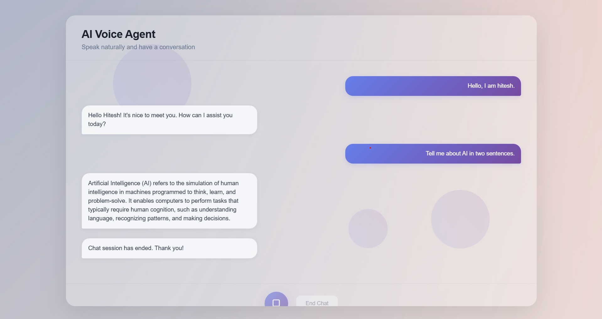

# AI Voice Agent
This project is an AI-powered conversational bot with real-time speech-to-text, language understanding, and text-to-speech responses. It allows users to talk naturally using their microphone, view chat history, and hear AI-generated replies for an interactive voice experience. The bot is built with a FastAPI backend, AssemblyAI for transcription, and Murf for speech synthesis.  
<p align="center">

</p>

## Features
**💬 Conversational AI** – Smart, context-aware replies.  
**⚡ Real-Time** – Instant playback with session memory.  
**🔒 Privacy** – In-memory sessions, no data stored.  
**🎙 Voice-to-Text** – Talk naturally with the bot.  
**🗣 Text-to-Speech** – Realistic voice responses.  
**🎛 Simple UI** – Clean, browser-based interface. 

## Technologies Used
* **Backend** - FastApi
* **Frontend** - HTML, CSS & Vanilla JS
* **External APIs** -   
    - Google Gemini → LLM Responses  
    - Murf AI → Text-to-Speech 
    - Assembly AI → Speech-to-Text 

## Project Structure
AIChat/  
├── Backend/       # FastAPI backend  
├── frontend/      # HTML, CSS, JS frontend  
├── README.md  

## Installation
- Setup the `venv` virtual environment variable in the Backend folder.
```bash
cd Backend
python -m venv venv
venv\Scripts\activate
pip install -r requirements.txt
```

- Create a `.env` file in the `./Backend` folder and set the required API keys.
```
MURF_API_KEY = YOUR_MURF_AI_API_KEY
ASSEMBLY_API_KEY = YOUR_ASSEMBLY_AI_API_KEY
GEMINI_API_KEY = YOUR_GEMINI_AI_API_KEY
```

- Run the Backend
```bash
cd Backend
uvicorn main:app --reload
```

- Go to the directed URL (Frontend is directly served by FastApi)
```
http://127.0.0.1:8000 
```